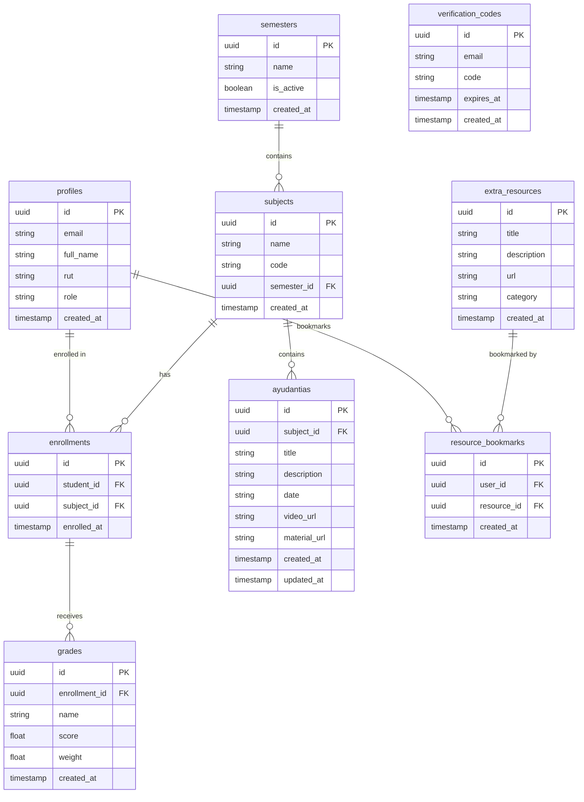

## Overview

The DIDG System uses **PostgreSQL** via Supabase as its primary database. The schema is designed to support academic management features including user profiles, courses, grades, resources, and authentication.

**Type Generation**: All database types are auto-generated from the Supabase schema and stored in `src/types/supabase.ts`.

## Entity Relationship Diagram



## Core Tables

### profiles

Stores user profile information, synchronized with Supabase Auth.

**Fields**:
- `id` (uuid, PK): User ID, matches `auth.users.id`
- `email` (string): User email address
- `full_name` (string): Full name of the user
- `rut` (string): Chilean national ID number (Rol Único Tributario)
- `role` (enum): User role - `'student'` or `'admin'`
- `created_at` (timestamp): Account creation timestamp

**Indexes**:
- Primary key on `id`
- Unique index on `rut`
- Index on `role` for filtering

**Usage Example** (`src/core/actions/students.ts:48`):
```typescript
const { data: profile } = await adminDb
  .from("profiles")
  .select("role")
  .eq("id", authData.user.id)
  .single();
```

<Note>
The `profiles` table is automatically populated via database triggers when a user is created in `auth.users`. The `full_name` and `rut` come from `user_metadata`.
</Note>

### subjects

Stores academic subjects/courses.

**Fields**:
- `id` (uuid, PK): Subject identifier
- `name` (string): Subject name (e.g., "Cálculo I")
- `code` (string): Subject code (e.g., "MAT101")
- `semester_id` (uuid, FK): Reference to semesters table
- `created_at` (timestamp): Creation timestamp
- `updated_at` (timestamp): Last update timestamp

**Relationships**:
- `semester_id` → `semesters.id` (many-to-one)

**CASCADE Behavior**:
- ON DELETE CASCADE: Deleting a subject removes all related ayudantias and enrollments

**Usage Example** (`src/core/actions/academic.ts:53`):
```typescript
const { error } = await supabase.from("subjects").insert({
  name: parsed.data.name,
  code: parsed.data.code,
  semester_id: parsed.data.semester_id,
});
```

### semesters

Stores academic semesters/periods.

**Fields**:
- `id` (uuid, PK): Semester identifier
- `name` (string): Semester name (e.g., "2025-1")
- `is_active` (boolean): Whether this semester is currently active
- `created_at` (timestamp): Creation timestamp

**Business Logic** (`src/core/actions/academic.ts:65`):
- Only one semester should be active at a time
- Used to filter current courses and enrollments

### ayudantias

Stores teaching assistant sessions/tutorials for subjects.

**Fields**:
- `id` (uuid, PK): Ayudantia identifier
- `subject_id` (uuid, FK): Reference to subjects table
- `title` (string): Session title
- `description` (string, nullable): Detailed description
- `date` (string, nullable): Session date
- `video_url` (string, nullable): Link to recorded session
- `material_url` (string, nullable): Path to uploaded materials in Supabase Storage
- `created_at` (timestamp): Creation timestamp
- `updated_at` (timestamp): Last update timestamp

**Relationships**:
- `subject_id` → `subjects.id` (many-to-one)

**Storage Integration** (`src/core/actions/ayudantias.ts:34-38`):
```typescript
const filePath = `${parsed.data.subject_id}/${Date.now()}_${file.name}`;
const { error: uploadError } = await supabase.storage
  .from("course-materials")
  .upload(filePath, file);
materialUrl = filePath;
```

<Note>
Material files are stored in the `course-materials` Storage bucket, organized by subject ID. The `material_url` field stores the path, not a full URL.
</Note>

### enrollments

Links students to subjects (enrollment records).

**Fields**:
- `id` (uuid, PK): Enrollment identifier
- `student_id` (uuid, FK): Reference to profiles table
- `subject_id` (uuid, FK): Reference to subjects table
- `enrolled_at` (timestamp): Enrollment timestamp

**Relationships**:
- `student_id` → `profiles.id` (many-to-one)
- `subject_id` → `subjects.id` (many-to-one)

**Constraints**:
- Unique constraint on `(student_id, subject_id)` to prevent duplicate enrollments

**Auto-Creation** (`src/core/actions/grades-upload.ts:74-82`):
Enrollments are automatically created when grades are uploaded if they don't exist:

```typescript
if (!enrollment) {
  const { data: newEnrollment, error: enrollError } = await supabaseAdmin
    .from("enrollments")
    .insert({ student_id: profile.id, subject_id: subjectId })
    .select("id")
    .single();
  enrollment = newEnrollment;
}
```

### grades

Stores individual grades/evaluations for students.

**Fields**:
- `id` (uuid, PK): Grade identifier
- `enrollment_id` (uuid, FK): Reference to enrollments table
- `name` (string): Evaluation name (e.g., "Midterm 1", "Quiz 3")
- `score` (float): Numeric score
- `weight` (float): Weight of this evaluation (default: 1.0)
- `created_at` (timestamp): Creation timestamp

**Relationships**:
- `enrollment_id` → `enrollments.id` (many-to-one)

**Bulk Upload** (`src/core/actions/grades-upload.ts:87-92`):
Grades can be bulk-uploaded via Excel files:

```typescript
const { error: gradeError } = await supabaseAdmin.from("grades").insert({
  enrollment_id: enrollment!.id,
  name: evaluationName,
  score: parseFloat(score),
  weight: 1.0 
});
```

## Resource Management

### extra_resources

Stores supplementary learning resources.

**Fields**:
- `id` (uuid, PK): Resource identifier
- `title` (string): Resource title
- `description` (string): Resource description
- `url` (string): External link to resource
- `category` (string): Resource category/type
- `created_at` (timestamp): Creation timestamp

**Usage** (`src/core/actions/resources.ts:8-11`):
```typescript
const { data, error } = await supabase
  .from("extra_resources")
  .select("*")
  .order("created_at", { ascending: false });
```

### resource_bookmarks

Tracks which users have bookmarked which resources.

**Fields**:
- `id` (uuid, PK): Bookmark identifier
- `user_id` (uuid, FK): Reference to profiles table
- `resource_id` (uuid, FK): Reference to extra_resources table
- `created_at` (timestamp): Bookmark timestamp

**Relationships**:
- `user_id` → `profiles.id` (many-to-one)
- `resource_id` → `extra_resources.id` (many-to-one)

**Constraints**:
- Unique constraint on `(user_id, resource_id)` to prevent duplicate bookmarks

**Toggle Logic** (`src/core/actions/bookmarks.ts:13-34`):
```typescript
const { data: existing } = await supabase
  .from("resource_bookmarks")
  .select("*")
  .eq("user_id", user.id)
  .eq("resource_id", resourceId)
  .single();

if (existing) {
  // Remove bookmark
  await supabase.from("resource_bookmarks").delete()
    .eq("user_id", user.id)
    .eq("resource_id", resourceId);
} else {
  // Add bookmark
  await supabase.from("resource_bookmarks")
    .insert({ user_id: user.id, resource_id: resourceId });
}
```

## Authentication & Security

### verification_codes

Stores temporary 2FA verification codes for admin login.

**Fields**:
- `id` (uuid, PK): Code identifier
- `email` (string): User email address
- `code` (string): 6-digit verification code
- `expires_at` (timestamp): Expiration timestamp (5 minutes from creation)
- `created_at` (timestamp): Creation timestamp

**Lifecycle** (`src/core/actions/auth-2fa.ts:70-76`):

1. **Generation**:
```typescript
const code = Math.floor(100000 + Math.random() * 900000).toString();
await adminDb.from("verification_codes").delete().eq("email", email);
await adminDb.from("verification_codes").insert({
  email,
  code,
  expires_at: new Date(Date.now() + 5 * 60 * 1000).toISOString(),
});
```

2. **Validation** (`src/core/actions/auth-2fa.ts:118-131`):
```typescript
const { data: record } = await adminDb
  .from("verification_codes")
  .select("*")
  .eq("email", email)
  .eq("code", code)
  .single();

if (!record) return { error: "Código inválido" };
if (new Date(record.expires_at) < new Date()) {
  return { error: "El código ha expirado" };
}
```

3. **Cleanup** (`src/core/actions/auth-2fa.ts:134`):
```typescript
await adminDb.from("verification_codes").delete().eq("id", record.id);
```

<Note>
Codes are single-use and expire after 5 minutes. Previous codes for the same email are deleted when a new code is generated.
</Note>

## Row Level Security (RLS)

All tables have RLS enabled with specific policies:

### profiles

- **SELECT**: Users can view their own profile and admins can view all
- **UPDATE**: Users can update their own profile
- **INSERT**: Handled via triggers on auth.users
- **DELETE**: Only via admin functions

### subjects

- **SELECT**: Public read access (all authenticated users)
- **INSERT/UPDATE/DELETE**: Admin only

### enrollments

- **SELECT**: Students can view their own enrollments, admins can view all
- **INSERT**: Admin only (via admin client)
- **DELETE**: Admin only

### grades

- **SELECT**: Students can view their own grades (via enrollment), admins can view all
- **INSERT/UPDATE**: Admin only (via admin client)
- **DELETE**: Admin only

### ayudantias

- **SELECT**: Public read access (all authenticated users)
- **INSERT/UPDATE/DELETE**: Admin only

### extra_resources

- **SELECT**: Public read access
- **INSERT/UPDATE/DELETE**: Admin only

### resource_bookmarks

- **SELECT**: Users can view their own bookmarks
- **INSERT/DELETE**: Users can manage their own bookmarks

### verification_codes

- **ALL**: Admin client only (bypasses RLS)

<Note type="warning">
**Admin Operations**: Some operations require the admin client (`createAdminClient()`) which uses the service role key to bypass RLS. This is necessary for:
- Creating enrollments during grade upload
- Managing verification codes
- User administration
</Note>

## Storage Buckets

### course-materials

Stores uploaded files for ayudantias.

**Structure**:
```
course-materials/
└── {subject_id}/
    ├── {timestamp}_{filename1}.pdf
    ├── {timestamp}_{filename2}.pptx
    └── ...
```

**Access** (`src/core/actions/ayudantias.ts:135-148`):
Signed URLs are generated for temporary access:

```typescript
const { data, error } = await supabase.storage
  .from("course-materials")
  .createSignedUrl(filePath, 60); // 60 seconds validity
```

**RLS Policies**:
- Authenticated users can read files
- Only admins can upload/delete files

## Database Triggers

### Profile Creation Trigger

Automatically creates a profile when a user signs up:

```sql
CREATE TRIGGER on_auth_user_created
  AFTER INSERT ON auth.users
  FOR EACH ROW
  EXECUTE FUNCTION handle_new_user();
```

The trigger function extracts `full_name`, `rut`, and `role` from `user_metadata` and inserts into `profiles`.

## Type Generation

Database types are auto-generated using the Supabase CLI:

```bash
supabase gen types typescript --project-id <project-id> > src/types/supabase.ts
```

This generates TypeScript interfaces for all tables, including `Row`, `Insert`, and `Update` types.

## Related Documentation

- [Architecture Overview](/architecture/overview) - System architecture
- [Tech Stack](/architecture/tech-stack) - Technologies used
- [Security](/architecture/security) - Security implementation
