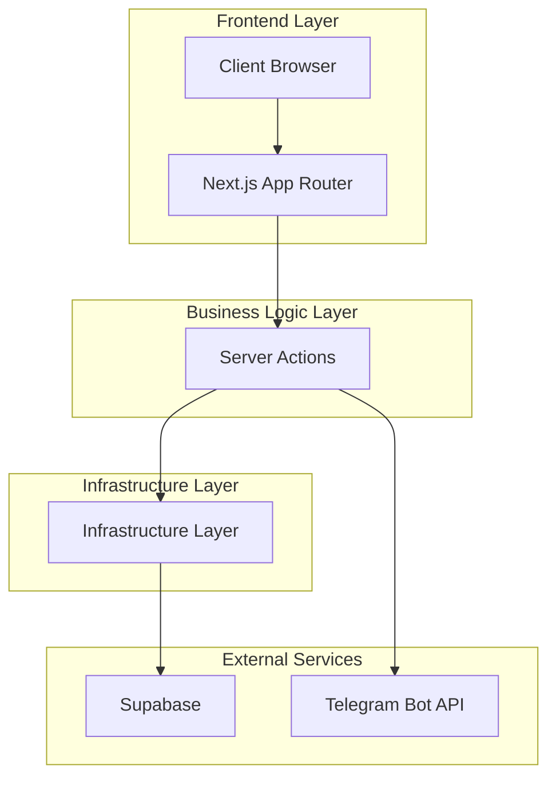
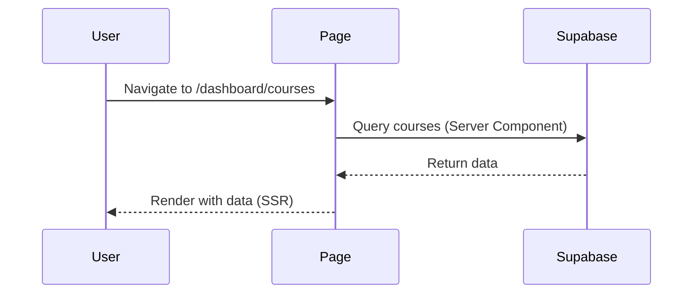
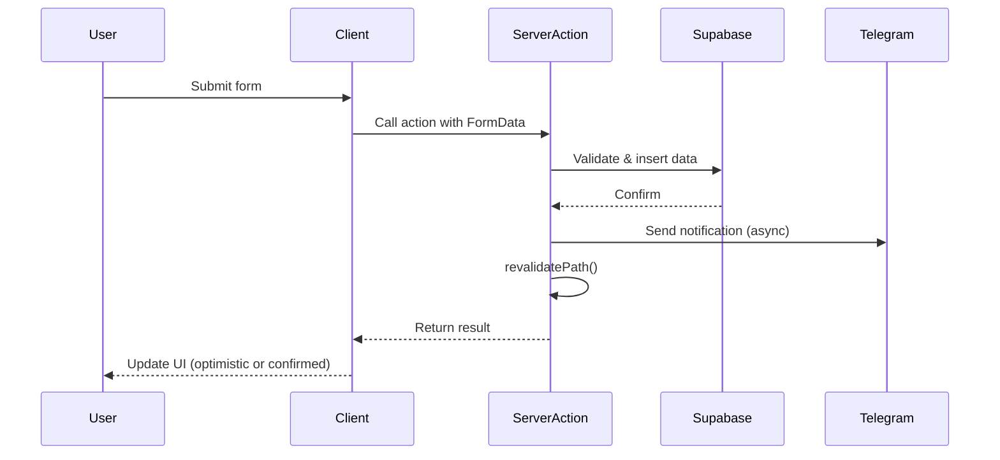

## Introduction

The DIDG System is a modern academic management SaaS platform built with Next.js 14, leveraging the App Router architecture for optimal performance and developer experience. The platform follows a clean architecture pattern with clear separation between presentation, business logic, and data access layers.

## Core Architecture

The system is built on **Next.js 14 App Router**, utilizing React Server Components (RSC) and Server Actions for a full-stack TypeScript application.



## Project Structure

The codebase follows a modular, domain-driven structure:

```
src/
├── app/                      # Next.js App Router pages and layouts
│   ├── (auth)/              # Authentication route group
│   │   └── login/           # Login page with 2FA
│   ├── dashboard/           # Admin dashboard (protected)
│   │   ├── courses/         # Course management
│   │   ├── grades/          # Grade management
│   │   ├── messages/        # Messaging system
│   │   ├── projects/        # Project management
│   │   ├── resources/       # Resource management
│   │   ├── settings/        # System settings
│   │   └── students/        # Student management
│   ├── courses/             # Public course listing
│   ├── grades/              # Student grade view
│   ├── profile/             # User profile
│   ├── projects/            # Public projects
│   ├── resources/           # Public resources
│   └── layout.tsx           # Root layout with providers
├── components/               # React components
│   ├── courses/             # Course-related components
│   ├── dashboard/           # Dashboard components
│   ├── feedback/            # Feedback and request components
│   ├── home/                # Homepage components
│   ├── layout/              # Layout components (Navbar, Footer)
│   ├── profile/             # Profile components
│   ├── projects/            # Project components
│   ├── providers/           # Context providers
│   ├── resources/           # Resource components
│   ├── tools/               # Utility components
│   └── ui/                  # Base UI components (Shadcn/ui)
├── core/                     # Business logic layer
│   ├── actions/             # Server Actions ("use server")
│   │   ├── academic.ts      # Semester and subject management
│   │   ├── auth-2fa.ts      # Two-factor authentication
│   │   ├── auth.ts          # Authentication actions
│   │   ├── ayudantias.ts    # Teaching assistant sessions
│   │   ├── bookmarks.ts     # Resource bookmarking
│   │   ├── grades-upload.ts # Grade upload and processing
│   │   ├── students.ts      # Student CRUD operations
│   │   └── ...
│   ├── lib/                 # Shared libraries
│   │   └── telegram.ts      # Telegram Bot API integration
│   └── utils/               # Utility functions
│       └── cn.ts            # Class name utilities
├── infrastructure/           # Infrastructure and data access
│   └── supabase/
│       ├── admin.ts         # Admin client (bypasses RLS)
│       ├── client.ts        # Browser client
│       └── server.ts        # Server-side client
├── context/                  # React Context providers
│   └── FloatingUIContext.tsx # UI visibility state
└── types/                    # TypeScript type definitions
    └── supabase.ts          # Auto-generated database types
```

<Note>
**Route Groups**: The `(auth)` folder is a Next.js route group that doesn't affect the URL structure but allows shared layouts for authentication-related pages.
</Note>

## Architectural Patterns

### Server Actions Pattern

The DIDG System extensively uses **Server Actions** (marked with `"use server"`) to handle all business logic and data mutations. This pattern provides:

- **Type safety**: End-to-end TypeScript from client to database
- **Security**: Logic runs on server, never exposed to client
- **Simplicity**: No need for API routes or separate backend
- **Performance**: Automatic request deduplication and caching

Example from `src/core/actions/auth-2fa.ts:9`:

```typescript
export async function initiateLogin(prevState: any, formData: FormData) {
  const email = formData.get("email") as string;
  const password = formData.get("password") as string;
  const supabase = await createClient();
  // ... authentication logic
}
```

### Client/Server Component Split

The application follows React Server Components best practices:

**Server Components** (default):
- All page components in `app/`
- Data fetching components
- Layout components with server-side authentication

**Client Components** (marked with `"use client"`):
- Interactive UI components
- Context providers (`src/context/FloatingUIContext.tsx:1`)
- Components using hooks (useState, useEffect, etc.)

### Three-Layer Architecture

1. **Presentation Layer** (`app/`, `components/`)
   - Pages and UI components
   - Client-side interactivity
   - Route handling

2. **Business Logic Layer** (`core/`)
   - Server Actions for data mutations
   - Domain logic and validation (using Zod)
   - External service integration

3. **Infrastructure Layer** (`infrastructure/`)
   - Database client configuration
   - Third-party service setup
   - Environment-specific implementations

## Data Flow

### Read Flow (Server-Side Rendering)



### Write Flow (Server Actions)



<Note>
The system uses `revalidatePath()` extensively to ensure UI consistency after mutations, leveraging Next.js's built-in cache invalidation.
</Note>

## Authentication Flow

Authentication is handled through a sophisticated two-tier system:

1. **Students**: Direct login via Supabase Auth
2. **Admins**: Login + Telegram 2FA verification

See the [Security Architecture](/architecture/security) page for detailed implementation.

## Key Design Decisions

### Why Server Actions?

The DIDG System uses Server Actions instead of traditional API routes because:

- **Type Safety**: Direct function calls with TypeScript
- **Reduced Boilerplate**: No need for API endpoint definitions
- **Better DX**: Colocation of mutations with related code
- **Progressive Enhancement**: Forms work without JavaScript

### Why Supabase?

Supabase provides:

- PostgreSQL database with real-time capabilities
- Built-in authentication with RLS
- Storage for course materials
- Auto-generated TypeScript types

### Admin Client Pattern

Certain operations require bypassing Row Level Security (RLS). The system uses a dedicated admin client (`src/infrastructure/supabase/admin.ts:5`) with the service role key for:

- User registration (`src/core/actions/students.ts:33`)
- Grade uploads (`src/core/actions/grades-upload.ts:11`)
- 2FA code storage (`src/core/actions/auth-2fa.ts:72`)

<Note type="warning">
**Security Warning**: The admin client has full database access. It should only be used in server-side code and never exposed to the client.
</Note>

## Deployment Architecture

The application is designed for deployment on **Vercel**:

- **Edge Functions**: Authentication middleware
- **Serverless Functions**: Server Actions and API routes
- **Static Assets**: Optimized images and fonts
- **Environment Variables**: Secure credential management

## Performance Optimizations

- **React Server Components**: Reduce client-side JavaScript
- **Streaming**: Progressive page rendering
- **Image Optimization**: Next.js Image component
- **Font Optimization**: Google Fonts with display=swap
- **Code Splitting**: Automatic route-based splitting

## Related Documentation

- [Tech Stack](/architecture/tech-stack) - Detailed technology breakdown
- [Database Schema](/architecture/database-schema) - Database structure and relationships
- [Security](/architecture/security) - Security implementation details
