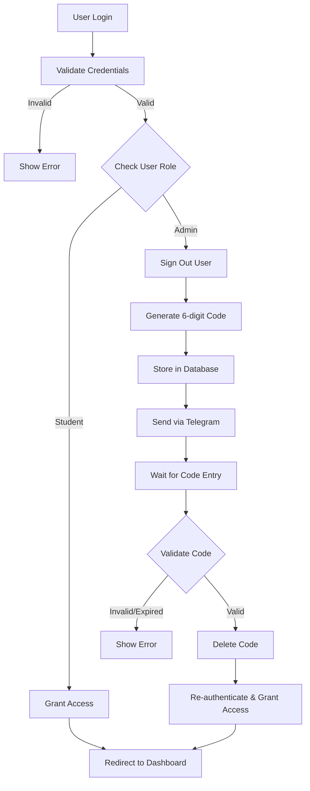

## Overview

The DIDG System implements a multi-layered security architecture with authentication, authorization, and data protection mechanisms. Security is enforced at the database level (Row Level Security), application level (Server Actions), and infrastructure level (Supabase).

## Authentication

### Authentication Provider

The system uses **Supabase Auth** for user authentication with email/password credentials.

**Implementation** (`src/infrastructure/supabase/server.ts:6-32`):
```typescript
export async function createClient() {
  const cookieStore = await cookies();
  return createServerClient<Database>(
    process.env.NEXT_PUBLIC_SUPABASE_URL!,
    process.env.NEXT_PUBLIC_SUPABASE_ANON_KEY!,
    {
      cookies: {
        get(name: string) {
          return cookieStore.get(name)?.value
        },
        set(name: string, value: string, options: CookieOptions) {
          cookieStore.set({ name, value, ...options })
        },
        remove(name: string, options: CookieOptions) {
          cookieStore.set({ name, value: '', ...options })
        },
      },
    }
  )
}
```

### Two-Tier Authentication System

The DIDG System implements role-based authentication with different flows for students and administrators.



### Student Authentication

Students authenticate with email and password only.

**Flow** (`src/core/actions/auth-2fa.ts:56-58`):
```typescript
if (profile?.role === "student") {
  redirect("/dashboard"); 
}
```

**Credentials**:
- **Email**: Student's institutional or personal email
- **Password**: Initially set to the student's RUT (Chilean ID)

### Admin Authentication with 2FA

Administrators must complete a two-factor authentication process using Telegram.

#### Step 1: Initial Login

**Implementation** (`src/core/actions/auth-2fa.ts:9-106`):

1. **Validate credentials** against Supabase Auth
2. **Check user role** from profiles table
3. **Sign out immediately** if admin (to prevent session creation)
4. **Generate 6-digit code** (random number between 100000-999999)
5. **Store code in database** with 5-minute expiration
6. **Send code via Telegram** to admin's configured chat

```typescript
export async function initiateLogin(prevState: any, formData: FormData) {
  const email = formData.get("email") as string;
  const password = formData.get("password") as string;
  const supabase = await createClient();
  const adminDb = createAdminClient();

  // Validate credentials
  const response = await supabase.auth.signInWithPassword({
    email,
    password,
  });

  if (response.error) {
    if (response.error.status === 429) {
      return { error: "⚠️ Demasiados intentos. Por favor espera 60 segundos." };
    }
    return { error: "Credenciales incorrectas" };
  }

  // Get user role
  const { data: profile } = await adminDb
    .from("profiles")
    .select("role")
    .eq("id", authData.user.id)
    .single();

  // Student: direct access
  if (profile?.role === "student") {
    redirect("/dashboard"); 
  }

  // Admin: require 2FA
  await supabase.auth.signOut();

  // Generate and store code
  const code = Math.floor(100000 + Math.random() * 900000).toString();
  await adminDb.from("verification_codes").delete().eq("email", email);
  await adminDb.from("verification_codes").insert({
    email,
    code,
    expires_at: new Date(Date.now() + 5 * 60 * 1000).toISOString(),
  });

  // Send via Telegram
  await sendTelegramMessage(message);

  return { step: "verify_2fa", email, password }; 
}
```

#### Step 2: Code Verification

**Implementation** (`src/core/actions/auth-2fa.ts:110-156`):

1. **Validate code** against database record
2. **Check expiration** (5-minute window)
3. **Delete code** (single-use)
4. **Re-authenticate** with original credentials
5. **Grant access** to dashboard

```typescript
export async function completeLogin(prevState: any, formData: FormData) {
  const email = formData.get("email") as string;
  const password = formData.get("password") as string;
  const code = formData.get("code") as string;
  const supabase = await createClient();
  const adminDb = createAdminClient();

  // Validate code
  const { data: record } = await adminDb
    .from("verification_codes")
    .select("*")
    .eq("email", email)
    .eq("code", code)
    .single();

  if (!record) {
    return { error: "Código inválido", step: "verify_2fa", email, password };
  }

  if (new Date(record.expires_at) < new Date()) {
    return { error: "El código ha expirado", step: "verify_2fa", email, password };
  }

  // Delete code (single-use)
  await adminDb.from("verification_codes").delete().eq("id", record.id);

  // Final login
  const { error: loginError } = await supabase.auth.signInWithPassword({
    email,
    password,
  });

  if (loginError) {
    return { error: "Error al iniciar sesión." };
  }

  redirect("/dashboard");
}
```

<Note type="warning">
**Security Consideration**: The admin is signed out immediately after initial credential validation to prevent unauthorized access if the 2FA step is not completed.
</Note>

### Telegram Integration

**Setup** (`src/core/lib/telegram.ts:3-5`):
```typescript
const BOT_TOKEN = process.env.TELEGRAM_BOT_TOKEN;
const CHAT_ID = process.env.TELEGRAM_CHAT_ID;
const BASE_URL = `https://api.telegram.org/bot${BOT_TOKEN}`;
```

**Message Format** (`src/core/actions/auth-2fa.ts:84-93`):
```typescript
const message = `🛡️ <b>SOLICITUD DE ACCESO 2FA</b>\n` +
                `──────────────────\n\n` +
                `👤 <b>Credenciales:</b>\n` +
                `├ <b>Usuario:</b> <code>${email}</code>\n` +
                `└ <b>Nivel:</b> ${roleIcon} ${profile?.role?.toUpperCase()}\n\n` +
                `🔑 <b>TU CÓDIGO DE ACCESO:</b>\n` +
                `👉 <code>${code}</code> 👈\n\n` +
                `──────────────────\n` +
                `⚠️ <i>Este código expira en breve.</i>\n` +
                `📅 ${date}`;
```

**Benefits**:
- **Out-of-band verification**: Code delivered through separate channel
- **Real-time delivery**: Instant notification via Telegram
- **Audit trail**: All login attempts logged in Telegram chat
- **Click-to-copy**: Code formatted for easy copying

## Rate Limiting

The system implements rate limiting to prevent brute-force attacks.

### Supabase Rate Limiting

Supabase Auth enforces automatic rate limiting on authentication endpoints.

**Error Handling** (`src/core/actions/auth-2fa.ts:26-28,36-38,144-147`):
```typescript
if (response.error.status === 429) {
  return { error: "⚠️ Demasiados intentos. Por favor espera 60 segundos." };
}

// Also catch in exception handler
if (err?.status === 429 || err?.code === 'over_request_rate_limit') {
  return { error: "⚠️ Demasiados intentos. Por favor espera 60 segundos." };
}
```

**Rate Limit Rules**:
- Maximum attempts per IP address
- Automatic 60-second cooldown after threshold
- Applied to both login steps (initial and 2FA completion)

<Note>
Rate limiting is enforced by Supabase and cannot be bypassed. The application gracefully handles rate limit errors and provides clear feedback to users.
</Note>

## Authorization

### Role-Based Access Control (RBAC)

The system implements two user roles:

1. **Student** (`role: 'student'`)
   - Access to own grades and enrollments
   - Can bookmark resources
   - View courses and materials
   - No administrative capabilities

2. **Admin** (`role: 'admin'`)
   - Full access to all data
   - User management (create/update/delete students)
   - Course management
   - Grade upload and management
   - Resource management

### Dashboard Protection

**Layout-Level Authorization** (`src/app/dashboard/layout.tsx:5-28`):
```typescript
export default async function DashboardLayout({
  children,
}: {
  children: React.ReactNode;
}) {
  const supabase = await createClient();

  // Check authentication
  const { data: { user }, error } = await supabase.auth.getUser();

  if (error || !user) {
    redirect("/login");
  }

  // Check authorization (admin only)
  const { data: profile } = await supabase
    .from("profiles")
    .select("role")
    .eq("id", user.id)
    .single();

  if (!userProfile || userProfile.role !== "admin") {
    redirect("/");
  }

  return (
    // ... dashboard UI
  );
}
```

**Protection Levels**:
1. **Authentication check**: Redirect to login if no session
2. **Authorization check**: Redirect to home if not admin
3. **Layout wrapping**: All dashboard routes inherit protection

## Row Level Security (RLS)

All database tables have RLS enabled, enforcing authorization at the database level.

### RLS Policy Examples

#### Students Can View Their Own Grades

```sql
CREATE POLICY "Students can view own grades"
ON grades FOR SELECT
USING (
  enrollment_id IN (
    SELECT id FROM enrollments 
    WHERE student_id = auth.uid()
  )
);
```

#### Only Admins Can Insert Grades

```sql
CREATE POLICY "Admins can insert grades"
ON grades FOR INSERT
WITH CHECK (
  EXISTS (
    SELECT 1 FROM profiles 
    WHERE id = auth.uid() AND role = 'admin'
  )
);
```

#### Public Read for Courses

```sql
CREATE POLICY "Authenticated users can view subjects"
ON subjects FOR SELECT
USING (auth.role() = 'authenticated');
```

### Admin Client Pattern

Some operations require bypassing RLS using the admin client.

**Admin Client Setup** (`src/infrastructure/supabase/admin.ts:5-16`):
```typescript
export function createAdminClient() {
  return createClient(
    process.env.NEXT_PUBLIC_SUPABASE_URL!,
    process.env.SUPABASE_SERVICE_ROLE_KEY!,
    {
      auth: {
        autoRefreshToken: false,
        persistSession: false,
      },
    }
  );
}
```

**Use Cases**:

1. **User Registration** (`src/core/actions/students.ts:33-42`):
   - Requires admin.createUser() API
   - Bypasses RLS to set user metadata

2. **Grade Upload** (`src/core/actions/grades-upload.ts:11-20`):
   - Creates enrollments if they don't exist
   - Inserts grades for multiple students

3. **2FA Code Management** (`src/core/actions/auth-2fa.ts:70-76`):
   - Stores verification codes
   - No RLS policies on verification_codes table

<Note type="warning">
**Critical Security Rule**: The admin client (`SUPABASE_SERVICE_ROLE_KEY`) must NEVER be exposed to the client. It should only be used in:
- Server Actions (`"use server"`)
- Server Components
- API Routes (if used)
</Note>

## Session Management

### Cookie-Based Sessions

Sessions are stored in HTTP-only cookies, managed by Supabase Auth.

**Server-Side Access** (`src/infrastructure/supabase/server.ts:7`):
```typescript
const cookieStore = await cookies();
```

**Cookie Configuration**:
- **HTTP-only**: Prevents JavaScript access (XSS protection)
- **Secure**: Only sent over HTTPS in production
- **SameSite**: CSRF protection
- **Path**: `/` (global scope)

### Session Validation

Every server-side request validates the session:

```typescript
const { data: { user }, error } = await supabase.auth.getUser();
if (error || !user) {
  redirect("/login");
}
```

### Session Termination

**Sign Out** (`src/core/actions/auth.ts:7-18`):
```typescript
export async function signOutAction() {
  const supabase = await createClient();
  
  // 1. Clear session in Supabase
  await supabase.auth.signOut();

  // 2. Clear cache
  revalidatePath("/", "layout");

  // 3. Redirect to home
  redirect("/");
}
```

## Server Actions Security

All data mutations use Server Actions, which provide built-in security benefits.

### Server-Only Execution

Server Actions are marked with `"use server"` and execute only on the server.

**Example** (`src/core/actions/students.ts:1`):
```typescript
"use server";
```

**Benefits**:
- Code never sent to client (smaller bundles)
- Secrets remain on server
- Business logic cannot be tampered with

### Input Validation

All Server Actions validate input using Zod schemas.

**Example** (`src/core/actions/academic.ts:7-24`):
```typescript
const SemesterSchema = z.object({
  name: z.string().min(4, "Ej: 2025-1"),
});

export async function createSemester(formData: FormData) {
  const name = formData.get("name") as string;
  
  const parsed = SemesterSchema.safeParse({ name });
  if (!parsed.success) throw new Error("Nombre de semestre inválido");
  
  // ... proceed with validated data
}
```

### Error Handling

Sensitive errors are caught and sanitized before returning to client.

```typescript
try {
  // ... operation
} catch (err: any) {
  console.error("Internal error:", err); // Server logs only
  return { error: "Error de conexión." }; // Generic message to client
}
```

## Data Protection

### Password Security

- **Hashing**: Passwords hashed by Supabase Auth (bcrypt)
- **Initial passwords**: Set to student's RUT, but can be changed
- **Password changes**: Require current password verification (`src/core/actions/auth.ts:50-58`)

### Sensitive Data Handling

**RUT (Chilean ID)**:
- Stored in `profiles.rut` and `user_metadata`
- Unique constraint prevents duplicates
- Used as initial password (should be changed)

**Email Addresses**:
- Stored in `auth.users.email` and `profiles.email`
- Validated by Supabase Auth
- Used for authentication

### Environment Variables

Sensitive configuration stored in environment variables:

```bash
# Public (can be exposed to client)
NEXT_PUBLIC_SUPABASE_URL=
NEXT_PUBLIC_SUPABASE_ANON_KEY=
NEXT_PUBLIC_SITE_URL=

# Private (server-only)
SUPABASE_SERVICE_ROLE_KEY=  # NEVER expose to client
TELEGRAM_BOT_TOKEN=          # NEVER expose to client
TELEGRAM_CHAT_ID=            # NEVER expose to client
```

<Note type="warning">
Only variables prefixed with `NEXT_PUBLIC_` are accessible in client-side code. All other variables are server-only.
</Note>

## File Security

### Storage Access Control

The `course-materials` bucket has RLS policies:

- **Read**: Authenticated users only
- **Upload**: Admins only
- **Delete**: Admins only

### Signed URLs

File access uses temporary signed URLs for additional security.

**Implementation** (`src/core/actions/ayudantias.ts:135-148`):
```typescript
export async function getSignedUrl(filePath: string) {
  const supabase = await createClient();

  const { data, error } = await supabase.storage
    .from("course-materials")
    .createSignedUrl(filePath, 60); // 60 seconds validity

  if (error) {
    throw new Error("No se pudo generar el enlace de descarga");
  }

  return data.signedUrl;
}
```

**Benefits**:
- Time-limited access (60 seconds)
- No direct bucket access
- Automatic expiration

## Audit & Monitoring

### Telegram Notifications

Critical events trigger Telegram notifications:

1. **Admin Login Attempts** (`src/core/actions/auth-2fa.ts:84-93`)
2. **New Student Registrations** (`src/core/actions/students.ts:62-73`)

**Example Notification**:
```
🎉 NUEVA MATRÍCULA REGISTRADA
──────────────────

👤 Información del Estudiante:
├ Nombre: Juan Pérez
├ RUT: 12.345.678-9
└ Email: juan.perez@example.com

──────────────────
📅 Fecha: 04/03/2026 14:30:00
#NewStudent #DIDG_System
```

### Database Logging

Supabase automatically logs:
- Authentication attempts
- API requests
- Database queries
- Error events

## Security Best Practices

### Implemented

- ✅ HTTPS-only in production (Vercel default)
- ✅ HTTP-only cookies for sessions
- ✅ Row Level Security on all tables
- ✅ Two-factor authentication for admins
- ✅ Rate limiting on authentication
- ✅ Input validation with Zod
- ✅ Server-side business logic (Server Actions)
- ✅ Secure file access (signed URLs)
- ✅ Environment variable protection
- ✅ Audit logging via Telegram

### Recommendations

- 🔄 Implement CSRF tokens for sensitive mutations
- 🔄 Add content security policy (CSP) headers
- 🔄 Enable database audit logging
- 🔄 Implement account lockout after failed attempts
- 🔄 Add email verification for new students
- 🔄 Implement password complexity requirements
- 🔄 Add session timeout and idle detection

## Related Documentation

- [Architecture Overview](/architecture/overview) - System architecture
- [Tech Stack](/architecture/tech-stack) - Technologies used
- [Database Schema](/architecture/database-schema) - Database structure
