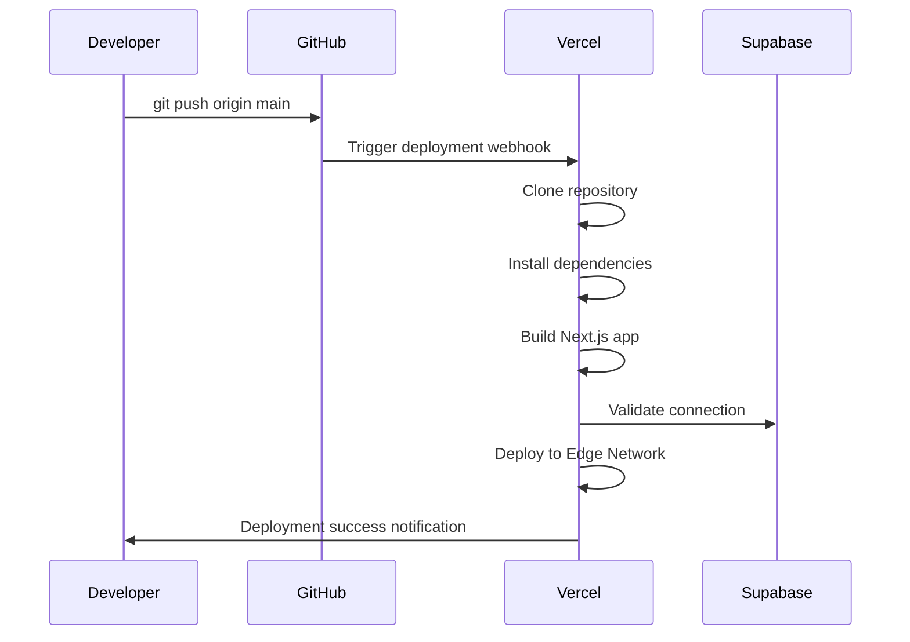

## Production Architecture

The DIDG System is deployed as a modern full-stack application with the following architecture:

```mermaid
graph TB
    Users[Users/Students] --> Vercel[Vercel Edge Network]
    Vercel --> NextJS[Next.js 14 App]
    NextJS --> Supabase[Supabase Cloud]
    NextJS --> Telegram[Telegram API]
    
    Supabase --> Auth[Auth Service]
    Supabase --> DB[(PostgreSQL)]
    Supabase --> Storage[Storage Buckets]
    
    subgraph "Vercel Platform"
        Vercel
        NextJS
    end
    
    subgraph "Supabase Platform"
        Auth
        DB
        Storage
    end
    
    style Vercel fill:#000,stroke:#fff
    style Supabase fill:#3ECF8E,stroke:#fff
    style NextJS fill:#000,stroke:#fff
```



### Key Components

- **Frontend & API**: Next.js 14 hosted on Vercel
- **Database**: PostgreSQL via Supabase
- **Authentication**: Supabase Auth with custom 2FA
- **File Storage**: Supabase Storage buckets
- **Notifications**: Telegram Bot API
- **Analytics**: Vercel Analytics

## Deployment Process

### Vercel Deployment

The application is automatically deployed to Vercel on every push to the main branch.

#### Initial Setup

1. **Connect Repository**:
   ```bash
   # Install Vercel CLI (optional)
   npm i -g vercel
   
   # Link your project
   cd didg-website
   vercel link
   ```

2. **Configure Project Settings**:
   - **Framework Preset**: Next.js
   - **Root Directory**: `./` (or `didg-website/` if monorepo)
   - **Build Command**: `npm run build`
   - **Output Directory**: `.next`
   - **Install Command**: `npm install`
   - **Node Version**: 20.x

3. **Set Environment Variables**:
   
   See [Environment Variables](/deployment/environment-variables) for the complete list.

   In Vercel Dashboard:
   - Go to **Project Settings** > **Environment Variables**
   - Add all required variables for Production, Preview, and Development
   - Mark sensitive variables (service keys) as sensitive

<Warning>
Never commit `.env` files to version control. Use Vercel's encrypted environment variable storage.
</Warning>

#### Deployment Flow



#### Build Optimization

**package.json** (`didg-website/package.json:5-9`):
```json
{
  "scripts": {
    "dev": "next dev",
    "build": "next build",
    "start": "next start",
    "lint": "next lint"
  }
}
```

**next.config.js** (`didg-website/next.config.js:1-25`):
```javascript
const nextConfig = {
  images: {
    remotePatterns: [
      {
        protocol: "https",
        hostname: "**.supabase.co",
      },
      {
        protocol: "https",
        hostname: "github.com",
      },
      {
        protocol: "https",
        hostname: "avatars.githubusercontent.com",
      },
    ],
  },
};
```

### Preview Deployments

Vercel automatically creates preview deployments for:
- Pull requests
- Non-production branches

**Preview Environment Variables**:
- Use separate Supabase project for previews (recommended)
- Or use same project with different bucket/table prefixes
- Enable `NEXT_PUBLIC_IS_PREVIEW=true` for preview deployments

## Supabase Production Setup

See [Supabase Setup](/deployment/supabase-setup) for detailed configuration.

### Quick Checklist

- [ ] Create production Supabase project
- [ ] Configure authentication providers
- [ ] Deploy database schema
- [ ] Enable Row Level Security policies
- [ ] Create storage buckets with policies
- [ ] Generate and secure service role key
- [ ] Configure SMTP for emails (optional)
- [ ] Set up database backups

## Domain Configuration

### Custom Domain Setup

1. **Add Domain in Vercel**:
   - Go to **Project Settings** > **Domains**
   - Add your custom domain (e.g., `didg.yourdomain.com`)
   - Vercel provides DNS configuration instructions

2. **DNS Configuration**:
   
   Add these records to your DNS provider:
   
   | Type  | Name | Value                     | TTL  |
   |-------|------|---------------------------|----- |
   | CNAME | didg | cname.vercel-dns.com      | 3600 |
   | A     | @    | 76.76.21.21               | 3600 |

3. **SSL Certificate**:
   - Vercel automatically provisions SSL via Let's Encrypt
   - Certificate auto-renews every 90 days
   - Enforces HTTPS by default

4. **Update Environment Variables**:
   ```bash
   NEXT_PUBLIC_SITE_URL=https://your-domain.com
   ```

### Vercel Domain Features

- **Automatic HTTPS**: SSL certificates provisioned automatically
- **Edge Network**: Global CDN with 100+ locations
- **DDoS Protection**: Built-in protection
- **Branch URLs**: Automatic URLs for git branches

## CI/CD Considerations

### Automatic Deployments

**Vercel Git Integration** handles:
- Production deployments on `main` branch
- Preview deployments on pull requests
- Automatic rollbacks on build failures

### Build Checks

Vercel runs these checks automatically:
- TypeScript type checking
- ESLint validation
- Next.js build

**Enable additional checks** in `package.json`:
```json
{
  "scripts": {
    "build": "next build",
    "type-check": "tsc --noEmit",
    "lint": "next lint",
    "test": "jest" // If you have tests
  }
}
```

### GitHub Actions (Optional)

For additional CI checks before Vercel deployment:

```yaml
# .github/workflows/ci.yml
name: CI

on:
  pull_request:
    branches: [main]
  push:
    branches: [main]

jobs:
  lint-and-type-check:
    runs-on: ubuntu-latest
    steps:
      - uses: actions/checkout@v3
      - uses: actions/setup-node@v3
        with:
          node-version: '20'
      - run: npm ci
      - run: npm run lint
      - run: npm run type-check
```

### Database Migrations

<Warning>
Supabase does not have automated migration tools. Database changes must be applied manually.
</Warning>

**Recommended Process**:
1. Test schema changes in development Supabase project
2. Document SQL migrations in `/migrations` folder
3. Apply to production via Supabase Dashboard SQL Editor
4. Regenerate TypeScript types

```bash
# Regenerate types after schema changes
supabase gen types typescript --project-id YOUR_PROJECT_ID > src/types/supabase.ts
```

## Monitoring and Logging

### Vercel Analytics

**Enabled in** `src/app/layout.tsx:12,66`:
```tsx
import { Analytics } from "@vercel/analytics/react"

export default function RootLayout({ children }) {
  return (
    <html>
      <body>
        {children}
        <Analytics />
      </body>
    </html>
  )
}
```

**Metrics Available**:
- Page views and unique visitors
- Top pages and referrers
- Device and browser breakdown
- Core Web Vitals (LCP, FID, CLS)

### Application Logging

**Vercel Runtime Logs**:
- Access via Vercel Dashboard > Project > Logs
- Real-time streaming logs
- Filter by deployment, time range, severity
- Retention: 7 days (Hobby), 30 days (Pro)

**Console Logs**:
```typescript
// Server-side logs appear in Vercel logs
console.log("User enrolled:", userId);
console.error("Failed to upload grade:", error);

// Client-side logs appear in browser console
```

### Supabase Monitoring

**Database Performance**:
- Dashboard > Project > Database > Query Performance
- Slow query detection
- Connection pooling stats

**API Analytics**:
- Dashboard > Project > API
- Request volume and error rates
- Auth activity
- Storage usage

**Database Logs**:
- Dashboard > Project > Logs
- Postgres logs
- API logs
- Auth logs

### Error Tracking (Recommended)

Consider integrating error tracking:

**Sentry** (recommended):
```bash
npm install @sentry/nextjs
```

```javascript
// sentry.client.config.js
import * as Sentry from "@sentry/nextjs";

Sentry.init({
  dsn: process.env.NEXT_PUBLIC_SENTRY_DSN,
  environment: process.env.NODE_ENV,
});
```

### Uptime Monitoring

**External monitoring** (recommended):
- **UptimeRobot**: Free HTTP(S) monitoring
- **Pingdom**: Advanced monitoring
- **Better Uptime**: Status pages

**Health Check Endpoint**:
```typescript
// app/api/health/route.ts
import { createClient } from '@/infrastructure/supabase/server'

export async function GET() {
  try {
    const supabase = await createClient()
    const { error } = await supabase.from('profiles').select('count').limit(1)
    
    if (error) throw error
    
    return Response.json({ status: 'ok', timestamp: new Date().toISOString() })
  } catch (error) {
    return Response.json(
      { status: 'error', message: error.message },
      { status: 500 }
    )
  }
}
```

## Production Best Practices

### Security

- [ ] **Environment Variables**: Never commit secrets to git
- [ ] **Service Role Key**: Only use in server-side code, never client-side
- [ ] **RLS Policies**: Enable on all Supabase tables
- [ ] **HTTPS Only**: Enforce via Vercel (automatic)
- [ ] **CORS**: Configure in Supabase Dashboard if needed
- [ ] **Rate Limiting**: Implement for sensitive endpoints

### Performance

- [ ] **Image Optimization**: Use Next.js `<Image>` component
- [ ] **Code Splitting**: Automatic with Next.js App Router
- [ ] **Edge Caching**: Configure `Cache-Control` headers
- [ ] **Database Indexes**: Add indexes for frequent queries
- [ ] **Connection Pooling**: Enabled by default in Supabase

### Reliability

- [ ] **Error Boundaries**: Implement React error boundaries
- [ ] **Fallback UI**: Handle loading and error states
- [ ] **Database Backups**: Enable in Supabase (automatic)
- [ ] **Graceful Degradation**: Handle Telegram/external service failures

### Cost Optimization

**Vercel**:
- Free tier: 100GB bandwidth, unlimited requests
- Pro: $20/month for team features

**Supabase**:
- Free tier: 500MB database, 1GB storage, 2GB bandwidth
- Pro: $25/month for 8GB database, 100GB storage

**Optimization tips**:
- Use Next.js Image Optimization (automatic)
- Implement pagination for large datasets
- Use Supabase storage instead of external services
- Cache frequently accessed data

## Deployment Checklist

Before going live:

### Pre-deployment
- [ ] All environment variables configured
- [ ] Database schema deployed
- [ ] RLS policies enabled and tested
- [ ] Storage buckets created with correct policies
- [ ] Telegram bot configured (optional)
- [ ] Custom domain configured
- [ ] SSL certificate active

### Post-deployment
- [ ] Test authentication flow
- [ ] Verify student and admin roles
- [ ] Test file uploads to storage
- [ ] Verify Telegram notifications (if enabled)
- [ ] Check Vercel Analytics integration
- [ ] Set up monitoring/alerting
- [ ] Document rollback procedure
- [ ] Create admin account

### Ongoing Maintenance
- [ ] Monitor error logs weekly
- [ ] Review database performance monthly
- [ ] Update dependencies quarterly
- [ ] Review and rotate secrets annually
- [ ] Test backup restoration annually

## Rollback Procedure

### Instant Rollback (Vercel)

1. Go to **Vercel Dashboard** > **Deployments**
2. Find the last working deployment
3. Click **⋯** > **Promote to Production**
4. Confirm promotion

Rollback is instant (< 30 seconds).

### Database Rollback (Supabase)

<Warning>
Database changes cannot be automatically rolled back. Always test in development first.
</Warning>

**Point-in-Time Recovery** (Pro plan):
1. Go to **Supabase Dashboard** > **Database** > **Backups**
2. Select restore point
3. Create new project from backup
4. Update Vercel environment variables to new project

## Related Documentation

- [Environment Variables](/deployment/environment-variables) - Complete variable reference
- [Supabase Setup](/deployment/supabase-setup) - Detailed Supabase configuration
- [Architecture Overview](/architecture/overview) - System architecture
- [Security](/architecture/security) - Security implementation